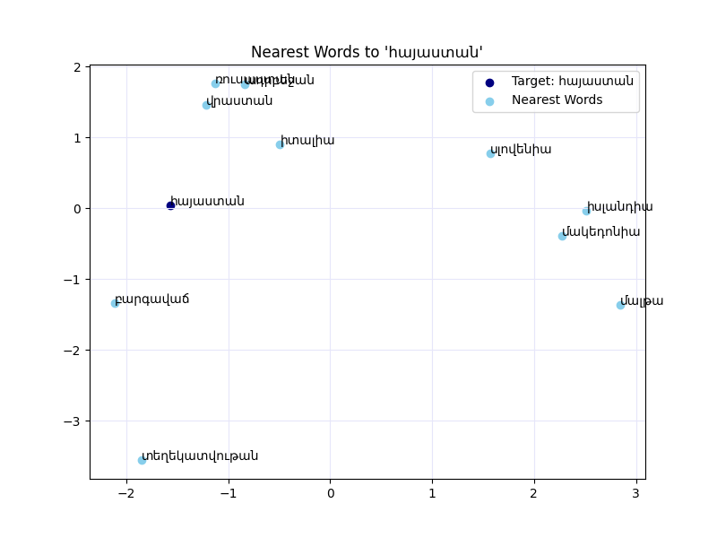

# Armenian Word2Vec Project

## Overview
This project builds a Word2Vec model for the Armenian language using preprocessed text data. The project is designed to run in Google Colab and leverages a structured directory layout for data management, model training, and visualization. The final model can be used for various natural language processing tasks including word similarity, analogy tasks, and semantic visualization.

## Armenian Language
Armenian (Հայերեն) is an Indo-European language with a rich literary history and a unique alphabet. Invented around 405 AD by Mesrop Mashtots, the Armenian script remains in use today. This project focuses on processing Armenian texts to capture semantic relationships between words and to support various NLP tasks in Armenian.

## Data Structure
The project follows a structured directory layout as shown below:

```
/content/drive/MyDrive/NPUA/NLP/word2vec
├── data/
│   ├── raw/            # Contains raw text files organized by topic in 'train' and 'test' folders.
│   ├── processed/      # Contains preprocessed text files.
│   ├── vocab/          # Contains vocabulary files (word-to-index and index-to-word mappings).
│   └── embeddings/     # Contains saved word vector files.
├── models/             # Contains saved Word2Vec models and checkpoints.
├── plots/              # Contains visualization graphs (e.g., nearest neighbor plots).
├── README.md           # Project documentation.
├── main.py             # Main file
└── requirements.txt    # List of required Python packages.
```

## Training Parameters
The Word2Vec model is trained using the following parameters:
- **Embedding Size:** 100 (Dimensionality of word vectors)
- **Window Size:** 5 (Context window size)
- **Minimum Count:** 5 (Words with frequency lower than this are ignored)
- **Architecture:** Skip-gram (SG = 1)
- **Epochs:** 100 (Total number of training iterations)
- **Learning Rate:** Starts at 0.025 and decays linearly to 0.0001 over training epochs
- **Workers:** Number of CPU cores used (leveraging multiprocessing)

## Visualization
The project includes visualization functions to help analyze the model's performance. For example, the nearest neighbor graph for the word **հայաստան** is generated using PCA for dimensionality reduction and saved in the plots folder.



This graph displays the target word **հայաստան** along with its most similar words, providing insights into the semantic space captured by the model.

## Usage
1. **Mount Google Drive:**  
   Mount your Google Drive in Colab to access the project directory.
2. **Preprocess Data:**  
   Run the preprocessing script to clean, normalize, and tokenize raw Armenian text files.
3. **Build Vocabulary:**  
   Generate vocabulary files from the processed data.
4. **Train Word2Vec:**  
   Execute the training script, which saves checkpoints every 5 epochs and retains the best and final models.
5. **Visualize Results:**  
   Use the visualization functions to generate graphs, such as the nearest neighbor plot for **հայաստան**.

## Requirements
See the accompanying `requirements.txt` file for the list of required packages.

## Additional Information
For more details, refer to the inline documentation within the code files and notebooks. This project is intended as a starting point for exploring NLP tasks in the Armenian language.
